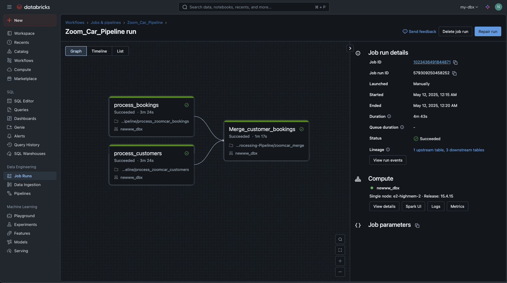
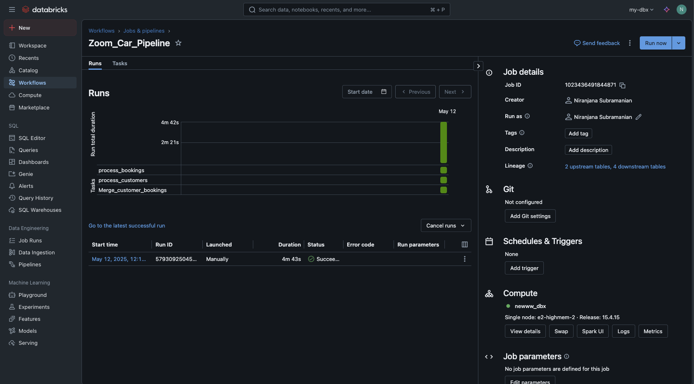
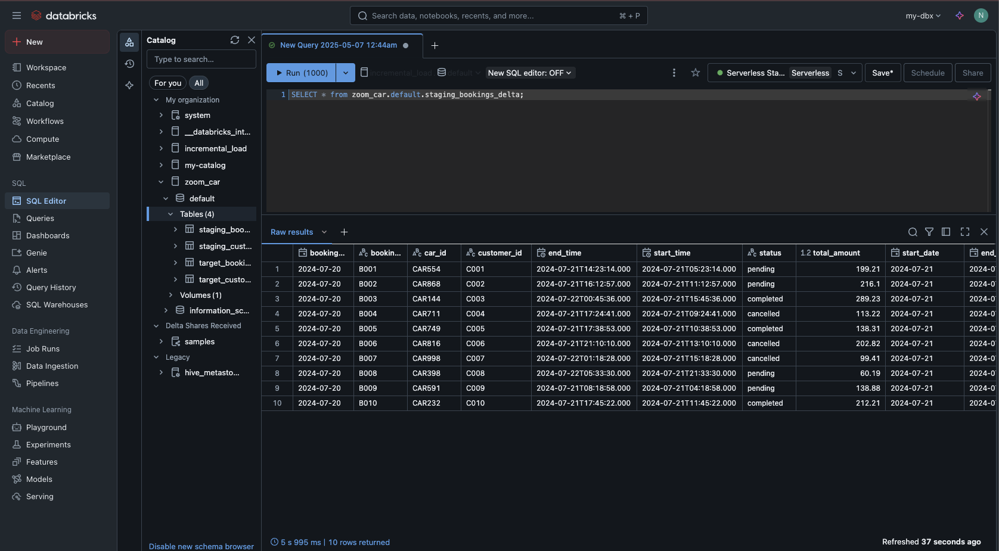
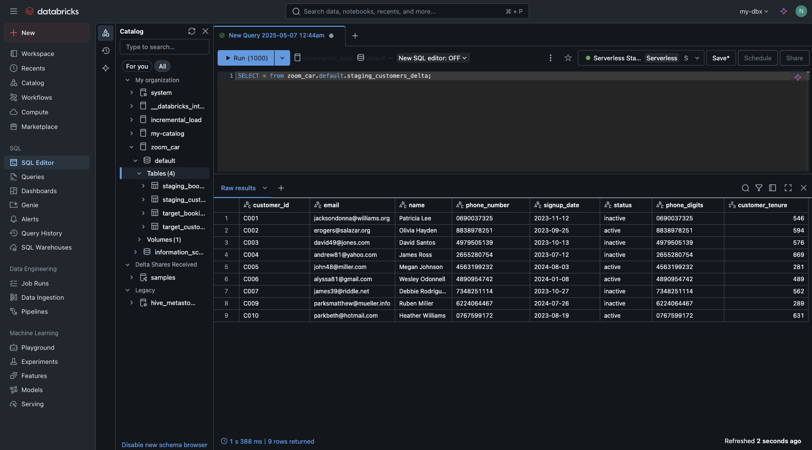
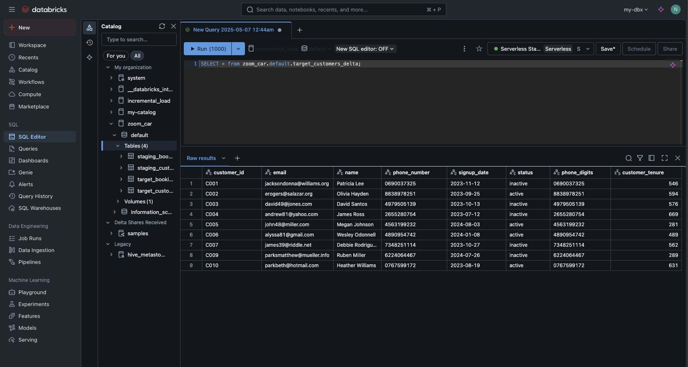

# 🚗 ZoomCar Data Processing Pipeline

This repository contains a PySpark-based ETL pipeline to process ZoomCar customer and booking data. It demonstrates the ingestion, staging, and merging of raw data into Delta Lake tables using Databricks.

---

## 📁 Project Structure

```
Zoom-Car-Data-Processing-Pipeline/
│
├── data/
│   ├── zoom_car_customers_20250511.json
│   └── zoom_car_bookings_20250511.json
│
├── screenshots/
│   ├── pipeline.png
│   ├── job_run.png
│   ├── staging_booking_delta.png
│   ├── staging_customers_delta.png
│   ├── target_bookings_delta.png
│   └── target_customers_delta.png
│
├── process_zoomcar_customers.ipynb
├── process_zoomcar_bookings.ipynb
├── zoomcar_merge.ipynb
└── workflow.json
```

---

## 🧪 Notebooks Overview

### 1. `process_zoomcar_customers.ipynb`
- Loads raw customer JSON data.
- Creates a Delta table in the staging layer for customers.

### 2. `process_zoomcar_bookings.ipynb`
- Loads raw booking JSON data.
- Creates a Delta table in the staging layer for bookings.

### 3. `zoomcar_merge.ipynb`
- Performs an SCD-like merge:
  - Updates existing records in the target if matched.
  - Deletes bookings with a "cancelled" status.
  - Inserts new records from staging into the target.

---

## 🖼️ Pipeline Snapshots

Below are the visual artifacts representing pipeline stages:

### 📌 Overall Pipeline Architecture


### ✅ Job Run Example


### 🔄 Delta Table Snapshots

#### Staging Tables
- Bookings: 
- Customers: 

#### Target Tables
- Bookings: 
- Customers: 

---

## ⚙️ Tech Stack

- **Apache Spark** (PySpark)
- **Delta Lake**
- **Databricks Notebooks**
- **JSON data format**
- **Python 3.x**

---

## 📌 Author

Niranjana Subramanian

---
